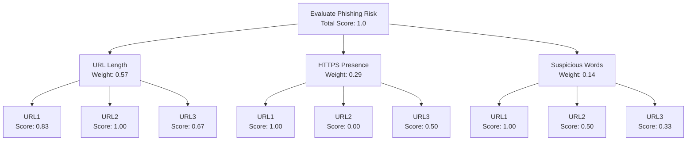

# API Phishing Checker with AHP

This project retrieves phishing data from free sources (e.g., OpenPhish feed) and uses Analytic Hierarchy Process (AHP) in MATLAB to evaluate and rank phishing URLs based on criteria like URL length, HTTPS presence, and suspicious words.

## Features
- Download and check URLs against phishing feeds.
- Extract features for AHP analysis.
- Rank URLs by risk score using AHP.

## Installation
1. Clone the repo: `git clone https://github.com/waldonhendricks/api-phising.git`
2. For Python: `pip install -r requirements.txt`
3. For MATLAB: Run scripts in MATLAB environment.

## Usage
- Run `python openphish_checker.py` to check a URL.
- Run `ahp_phishing.m` in MATLAB for AHP ranking.

## AHP Hierarchy Graph

