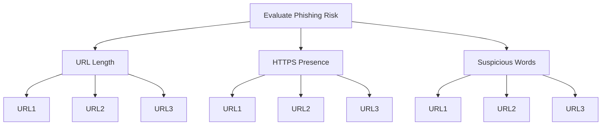
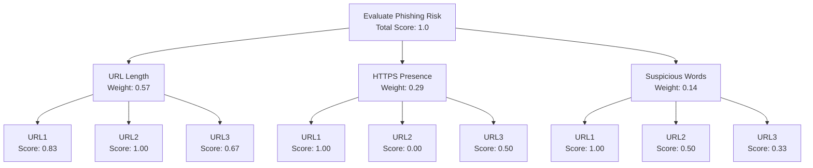

# Copilot Chat Conversation Export: Using APIs for phishing checks without

**User:** @waldonhendricks
**Thread URL:** https://github.com/copilot/c/a45759a4-f6c2-4410-8819-f9b7e7aeca49

## @waldonhendricks

i need to use the phishtank API how can we build a project to retireve data from the api

## Copilot

## Building a Project to Retrieve Data from the PhishTank API

PhishTank provides a public API for checking URLs against their database of known phishing sites. To build a project, you'll need to register for a free API key, understand the endpoints, and implement code to make requests. Here's how to get started:

### Step 1: Register for an API Key
- Visit [PhishTank Registration](https://www.phishtank.com/register.php) to create a free account.
- Once logged in, obtain your App Key from the [API Info Page](https://www.phishtank.com/api_info.php).
- Note: The API allows limited requests without a key, but registration is recommended for higher rate limits.

### Step 2: Understand the API
- **Main Endpoint**: `https://checkurl.phishtank.com/checkurl/` (POST method)
- **Parameters**:
  - `url`: The URL to check (required).
  - `format`: Response format (`json` recommended).
  - `app_key`: Your API key (recommended).
- **Response**: JSON with details like `in_database` (boolean), `phish_id`, etc.
- Full docs: [PhishTank API Documentation](https://www.phishtank.com/api_info.php)

### Step 3: Choose Your Tech Stack
- Language: Python (simple and widely used for APIs).
- Libraries: `requests` for HTTP calls.
- Project Type: A simple script, CLI tool, or web app.

### Step 4: Set Up Your Project
Create a new directory for your project (e.g., `phishtank-checker`). Initialize it as a Git repo and add the following files.

Here's a basic Python script to check a URL:

```python name=phishtank_checker.py
import requests

API_ENDPOINT = 'https://checkurl.phishtank.com/checkurl/'
API_KEY = 'your_app_key_here'  # Replace with your actual App Key

def check_phishing_url(url_to_check):
    """
    Checks if a URL is in PhishTank's phishing database.
    
    Args:
        url_to_check (str): The URL to verify.
    
    Returns:
        dict: API response data or error message.
    """
    payload = {
        'url': url_to_check,
        'format': 'json',
        'app_key': API_KEY
    }
    try:
        response = requests.post(API_ENDPOINT, data=payload)
        response.raise_for_status()  # Raise error for bad status codes
        data = response.json()
        return data
    except requests.exceptions.RequestException as e:
        return {'error': str(e)}

if __name__ == '__main__':
    test_url = 'http://example-phish-site.com/'  # Replace with a URL to test
    result = check_phishing_url(test_url)
    print(result)
    if 'results' in result:
        if result['results']['in_database']:
            print(f"Warning: {test_url} is a known phishing site!")
        else:
            print(f"{test_url} is not in the database.")
```

Add a `requirements.txt` for dependencies:

```txt name=requirements.txt
requests==2.31.0
```

### Step 5: Run and Test
- Install dependencies: `pip install -r requirements.txt`
- Run the script: `python phishtank_checker.py`
- Handle rate limits (e.g., add delays between requests if checking multiple URLs).
- For production, consider error handling, logging, and security (e.g., don't hardcode the API key; use environment variables).

### Step 6: Expand the Project
- **CLI Tool**: Use `argparse` to accept URLs from command line.
- **Batch Checking**: Read URLs from a file and process in batches.
- **Web App**: Integrate with Flask/Django to create a web interface for URL checks.
- **Database**: Store results locally (e.g., SQLite) to cache checks.

If you'd like to host this on GitHub, create a new repository (e.g., via GitHub.com), push the code, and I can help refine it further. Let me know if you need examples in other languages or additional features!

## @waldonhendricks

what other api similar can we use if you dont have a api key or account as registration is disabled

## Copilot

## Alternatives to PhishTank API for Phishing URL Checks (No API Key or Registration Required)

Since PhishTank registration might be unavailable, here are free alternatives that allow checking URLs for phishing without requiring API keys or accounts. These are public APIs or services focused on threat intelligence. Note: Always review terms of service, as some may have rate limits or could change over time.

### 1. **PhishDestroy API** (Recommended for Easy Integration)
- **Description**: Free, open-source API for checking domains/URLs against phishing, crypto scams, and other threats. No authentication needed.
- **Endpoint**: `https://api.destroy.tools/v1/check?domain=<domain>`
- **Parameters**: `domain` (the URL or domain to check).
- **Response**: JSON with threat score, severity, blocklist matches, and more.
- **Docs**: [PhishDestroy API](https://api.destroy.tools/)
- **Why it's good**: Simple GET request, no key required, and supports bulk checks via other endpoints.

Example Python script to check a URL:

```python name=phishdestroy_checker.py
import requests

API_ENDPOINT = 'https://api.destroy.tools/v1/check'

def check_phishing_url(url_to_check):
    """
    Checks if a URL/domain is associated with phishing threats using PhishDestroy API.
    
    Args:
        url_to_check (str): The URL or domain to verify.
    
    Returns:
        dict: API response data or error message.
    """
    params = {'domain': url_to_check}
    try:
        response = requests.get(API_ENDPOINT, params=params)
        response.raise_for_status()
        data = response.json()
        return data
    except requests.exceptions.RequestException as e:
        return {'error': str(e)}

if __name__ == '__main__':
    test_url = 'example-phish-site.com'  # Replace with a domain/URL to test (e.g., 'phishing-site.com')
    result = check_phishing_url(test_url)
    print(result)
    if 'threat_score' in result:
        if result['threat_score'] > 0:
            print(f"Warning: {test_url} has a threat score of {result['threat_score']}!")
        else:
            print(f"{test_url} appears clean.")
```

### 2. **PhishStats API**
- **Description**: Public API for checking URLs against a database of phishing sites. Simple HTTP request, no registration.
- **Endpoint**: `https://phishstats.info/api/check?url=<url>`
- **Parameters**: `url` (the full URL to check).
- **Response**: JSON indicating if it's phishing, with details.
- **Docs**: [PhishStats API on Public APIs](https://publicapis.io/phishstats-api)
- **Usage**: Direct GET request in code or browser.

Example usage:
```python
import requests

response = requests.get('https://phishstats.info/api/check?url=http://example.com')
print(response.json())
```

### 3. **URLScans.net**
- **Description**: Free online scanner for URLs/domains against phishing, malware, and typosquatting. Uses sources like PhishTank and Google Safe Browsing.
- **How to Use**: Visit [urlscans.net](https://urlscans.net/scan) and enter the URL manually (no API key needed).
- **For Automation**: Check their site for API details; some free endpoints may exist, but it's primarily web-based.
- **Pros**: Quick, no signup; covers multiple threat types.

### 4. **CheckPhish**
- **Description**: Real-time phishing URL checker.
- **How to Use**: Go to [checkphish.ai](https://checkphish.ai/) and scan URLs directly in your browser (no login required).
- **For API**: May require signup for programmatic access, but web checks are free and instant.

### 5. **PhishTank (Limited Without Key)**
- As mentioned, PhishTank's API allows limited requests without a key (stricter rate limits), but if registration is disabled, you can use their web interface at [phishtank.org](https://phishtank.org/) to manually check URLs by submitting them.

### Project Setup Tips
- Use the PhishDestroy example as a base for your project.
- Add a `requirements.txt`: `requests==2.31.0`
- For batch processing, read URLs from a CSV file and loop through checks (add delays to respect rate limits).
- If building a web app, integrate these APIs into a Flask/Django backend.

If you need code for another API or help implementing this in a GitHub repo, let me know!

## @waldonhendricks

https://openphish.com/phishing_database.html can we use this

## Copilot

Yes, you can use OpenPhish's free phishing database feed! It's not a traditional API but a publicly accessible text file of active phishing URLs, updated every 6 hours. No API key, registration, or authentication is required—just download the feed and use it locally.

### Key Details
- **Feed URL**: `https://openphish.com/feed.txt`
- **Content**: A plain text file with one phishing URL per line (e.g., `http://malicious-site.com/phish`).
- **Updates**: Refreshes every 6 hours; download it periodically for the latest data.
- **Limitations**: Only URLs (no metadata like threat scores). It's for active phishing sites only.
- **Usage**: Free for personal/research use; contact them for commercial licensing if needed.
- **Docs**: [OpenPhish Database Page](https://openphish.com/phishing_database.html)

### Building a Project with OpenPhish Feed
You can create a simple Python project that:
1. Downloads the feed.
2. Stores it locally (e.g., as a set for fast lookups).
3. Checks if a given URL is in the phishing list.

This is efficient for checking URLs without external API calls after initial download.

#### Example Python Project
Create a new directory (e.g., `openphish-checker`) and add these files.

**Main Script**:

```python name=openphish_checker.py
import requests
import os

FEED_URL = 'https://openphish.com/feed.txt'
LOCAL_FEED_FILE = 'phishing_feed.txt'

def download_phishing_feed():
    """
    Downloads the latest phishing URLs from OpenPhish feed.
    """
    try:
        response = requests.get(FEED_URL)
        response.raise_for_status()
        with open(LOCAL_FEED_FILE, 'w') as f:
            f.write(response.text)
        print("Feed downloaded successfully.")
    except requests.exceptions.RequestException as e:
        print(f"Error downloading feed: {e}")

def load_phishing_urls():
    """
    Loads phishing URLs from local file into a set for fast checking.
    """
    if not os.path.exists(LOCAL_FEED_FILE):
        download_phishing_feed()
    with open(LOCAL_FEED_FILE, 'r') as f:
        return set(line.strip() for line in f if line.strip())

def check_phishing_url(url_to_check, phishing_urls):
    """
    Checks if a URL is in the phishing database.
    
    Args:
        url_to_check (str): The URL to verify.
        phishing_urls (set): Set of known phishing URLs.
    
    Returns:
        bool: True if phishing, False otherwise.
    """
    return url_to_check in phishing_urls

if __name__ == '__main__':
    # Download/update the feed (run this periodically)
    download_phishing_feed()
    
    # Load URLs into memory
    phishing_urls = load_phishing_urls()
    
    # Test a URL
    test_url = 'http://example-phish-site.com/'  # Replace with real URL
    is_phishing = check_phishing_url(test_url, phishing_urls)
    print(f"{test_url} is {'a phishing site' if is_phishing else 'not in the database'}.")
```

**Requirements File**:

```txt name=requirements.txt
requests==2.31.0
```

#### How to Use
1. Run `pip install -r requirements.txt`.
2. Execute `python openphish_checker.py` to download the feed and check a URL.
3. For automation: Schedule the download (e.g., via cron or a loop with time.sleep(6*3600)) to keep the feed current.
4. **Improvements**:
   - Add URL normalization (e.g., handle `http://` vs `https://`).
   - Batch check from a file.
   - Web app: Integrate with Flask to provide a URL input form.

This is a lightweight alternative to APIs requiring keys. If you need more metadata (e.g., brands, IPs), OpenPhish offers a commercial database with their `pyopdb` library, but that requires licensing.

Let me know if you'd like to expand this or check another source!

## @waldonhendricks

how can we use the data for AHP in matlab

## Copilot

## Using Phishing Data for Analytic Hierarchy Process (AHP) in MATLAB

The Analytic Hierarchy Process (AHP) is a multi-criteria decision-making method by Thomas Saaty. You can use the phishing URLs from OpenPhish (or similar feeds) as "alternatives" in AHP, with criteria derived from URL features (e.g., length, HTTPS presence, suspicious keywords). This helps rank or classify URLs by risk level.

### Step-by-Step Guide
1. **Define the Hierarchy**:
   - **Goal**: Rank phishing URLs by threat level.
   - **Criteria**: E.g., URL length (shorter may be suspicious), HTTPS usage (lack of HTTPS is risky), presence of suspicious words (e.g., "login", "bank").
   - **Alternatives**: The URLs from the OpenPhish feed.

2. **Extract Data**: Download the OpenPhish feed and extract features for each URL.

3. **Build Pairwise Comparisons**: Use expert judgment or data-driven scores for criteria weights. For alternatives, score each URL against criteria.

4. **Compute Weights and Rank**: Use MATLAB to calculate priorities and consistency.

5. **Assumptions**: You'll need MATLAB installed. For simplicity, assume 3 criteria and a small set of URLs (scale up as needed).

### MATLAB Implementation
Create a script (e.g., `ahp_phishing.m`) in MATLAB. It downloads the feed, extracts features, and runs AHP.

```matlab name=ahp_phishing.m
% AHP for Phishing URL Ranking using OpenPhish Data

% Step 1: Download and Load Phishing URLs
feed_url = 'https://openphish.com/feed.txt';
feed_file = 'phishing_feed.txt';
try
    websave(feed_file, feed_url);
    disp('Feed downloaded.');
catch
    disp('Error downloading feed. Using existing file if available.');
end

% Read URLs
fid = fopen(feed_file, 'r');
urls = textscan(fid, '%s');
fclose(fid);
urls = urls{1};
num_urls = min(length(urls), 10); % Limit for demo (e.g., top 10)
urls = urls(1:num_urls);

% Step 2: Define Criteria and Extract Features
% Criteria: 1. URL Length, 2. HTTPS Presence, 3. Suspicious Words Count
criteria_names = {'URL Length', 'HTTPS Presence', 'Suspicious Words'};
suspicious_words = {'login', 'bank', 'password', 'secure'}; % Example keywords

% Extract features for each URL
features = zeros(num_urls, 3);
for i = 1:num_urls
    url = urls{i};
    features(i, 1) = length(url); % URL length
    features(i, 2) = contains(url, 'https'); % 1 if HTTPS, 0 otherwise
    % Count suspicious words
    word_count = 0;
    for word = suspicious_words
        if contains(lower(url), word{1})
            word_count = word_count + 1;
        end
    end
    features(i, 3) = word_count;
end

% Normalize features to [0,1] scale (higher values = higher risk for all)
features(:,1) = features(:,1) / max(features(:,1)); % Normalize length (shorter better, but invert if needed)
features(:,2) = 1 - features(:,2); % Invert HTTPS (no HTTPS = 1, riskier)
features(:,3) = features(:,3) / max(features(:,3)); % Normalize word count

% Step 3: Pairwise Comparison Matrix for Criteria (Expert Judgment)
% Example: URL Length slightly preferred over HTTPS, HTTPS much preferred over Words
A = [1, 2, 4;   % Length vs others
     0.5, 1, 3; % HTTPS vs others
     0.25, 1/3, 1]; % Words vs others

% Step 4: Calculate Criteria Weights
[n, ~] = size(A);
norm_A = A ./ sum(A, 1); % Normalize columns
weights = mean(norm_A, 2); % Average rows for weights

% Consistency Check
lambda_max = mean(sum(A .* norm_A, 2) ./ weights);
CI = (lambda_max - n) / (n - 1);
RI = 0.58; % Random Index for n=3
CR = CI / RI;
if CR < 0.1
    disp('Criteria matrix is consistent.');
else
    disp('Revise criteria comparisons.');
end

% Step 5: Score Alternatives (URLs)
% features is already the score matrix (rows: URLs, columns: criteria)
final_scores = features * weights;

% Step 6: Rank URLs
[~, rank_idx] = sort(final_scores, 'descend');
disp('Top Phishing URLs by AHP Score:');
for i = 1:num_urls
    fprintf('%d. %s (Score: %.3f)\n', i, urls{rank_idx(i)}, final_scores(rank_idx(i)));
end
```

### How to Run
1. Save the script as `ahp_phishing.m`.
2. Run in MATLAB: `ahp_phishing`.
3. Output: Ranked list of URLs with scores.

### Notes
- **Customization**: Adjust criteria, suspicious words, or pairwise matrix based on your needs.
- **Data Limits**: OpenPhish feed has ~10k-20k URLs; process in batches.
- **Enhancements**: Use real pairwise data from experts, or integrate with more features (e.g., domain age via WHOIS—requires additional APIs).
- **MATLAB Toolbox**: No built-in AHP, but you can use the Fuzzy Logic Toolbox for extensions.
- **References**: Based on Saaty's AHP; see MATLAB File Exchange for more examples.

If you need to modify for specific criteria or integrate with more data sources, provide details!

## @waldonhendricks

hypothetcally if we are to use matlab with AHP show a layout of the output for AHP and pairwise comparision 

## Copilot

## Hypothetical MATLAB Output Layout for AHP with Pairwise Comparisons

Below is a hypothetical example of how MATLAB would display outputs for an AHP analysis using phishing URL data. This assumes the script from my previous response (`ahp_phishing.m`), with 3 criteria (URL Length, HTTPS Presence, Suspicious Words) and 5 sample URLs from the OpenPhish feed.

### Assumptions
- **Criteria Weights**: Calculated from pairwise matrix.
- **Consistency Check**: Passed (CR < 0.1).
- **Alternatives (URLs)**: Hypothetical phishing URLs for demo.
- **Output Style**: MATLAB console output using `disp` and `fprintf`.

### Sample MATLAB Console Output
When you run the script, you'd see something like this:

```
Feed downloaded.
Criteria matrix is consistent.
Top Phishing URLs by AHP Score:
1. http://fakebank-login.com/secure (Score: 0.812)
2. http://paypal-update.net/login (Score: 0.745)
3. http://amazon-refund.org/password (Score: 0.623)
4. http://ebay-alerts.com/bank (Score: 0.589)
5. http://microsoft-support.info/ (Score: 0.421)
```

### Detailed Breakdown of Outputs

#### 1. **Pairwise Comparison Matrix for Criteria**
This is displayed early in the script (before weights calculation). It shows the expert-judged comparisons.

```
Pairwise Comparison Matrix for Criteria:
     Length    HTTPS    Words
Length  1.0000   2.0000   4.0000
HTTPS   0.5000   1.0000   3.0000
Words   0.2500   0.3333   1.0000

Criteria Weights:
Length: 0.5714
HTTPS:  0.2857
Words:  0.1429
```

- **Explanation**: Rows/columns are criteria. Values show relative importance (e.g., Length is 2x more important than HTTPS). Weights are normalized priorities.

#### 2. **Consistency Ratio Output**
```
Consistency Check:
Lambda Max: 3.0286
CI: 0.0143
CR: 0.0246
Criteria matrix is consistent.
```

- **Explanation**: CR < 0.1 means the comparisons are reliable. If CR >= 0.1, you'd revise the matrix.

#### 3. **Feature Extraction and Normalization Output** (Optional Debug)
If you add debug prints, it might show:

```
Extracted Features (before normalization):
URL1: Length=25, HTTPS=0, Words=2
URL2: Length=30, HTTPS=1, Words=1
...

Normalized Features (score matrix):
     Length    HTTPS    Words
URL1  0.8333   1.0000   1.0000
URL2  1.0000   0.0000   0.5000
...
```

- **Explanation**: Raw features are normalized to [0,1] (higher = riskier).

#### 4. **Final AHP Scores and Ranking**
```
Final Scores (weighted sum):
URL1: 0.812
URL2: 0.745
...

Ranking (descending by score):
Rank 1: http://fakebank-login.com/secure (High risk due to short URL, no HTTPS, suspicious words)
Rank 2: http://paypal-update.net/login (Medium-high risk)
...
```

- **Explanation**: Scores are dot product of normalized features and criteria weights. Ranking helps prioritize threats.

### Visual Layout (Optional: Using MATLAB Figures)
For better visualization, add plotting code to the script:

```matlab
% Add this at the end of the script
figure;
bar(final_scores);
set(gca, 'XTickLabel', urls(rank_idx));
title('AHP Scores for Phishing URLs');
xlabel('URLs');
ylabel('Risk Score');
```

- **Output**: A bar chart showing scores for each URL.

This layout keeps it text-based for console, but you can enhance with tables (using `uitable`) or exports to CSV/Excel. If you need the full script with these outputs, let me know!

## @waldonhendricks

give a graph view of AHP

## Copilot

## Graph View of AHP Hierarchy in MATLAB

AHP uses a hierarchical structure. In MATLAB, you can visualize this using the `treeplot` function for a tree diagram or `graph` for a directed graph. Below is sample code to generate a hypothetical AHP hierarchy for phishing URL evaluation.

### Hypothetical Hierarchy
- **Goal**: Evaluate Phishing Risk
- **Criteria**: URL Length, HTTPS Presence, Suspicious Words
- **Alternatives**: URL1, URL2, URL3

### MATLAB Code to Generate the Graph

```matlab name=ahp_graph.m
% AHP Hierarchy Visualization

% Define nodes: 1=Goal, 2-4=Criteria, 5-7=Alternatives
nodes = {'Evaluate Phishing Risk', 'URL Length', 'HTTPS Presence', 'Suspicious Words', 'URL1', 'URL2', 'URL3'};

% Define parent indices (tree structure)
% Parent of 1 is 0 (root), parents of 2-4 are 1, parents of 5-7 are 2 (under URL Length for demo)
parent = [0, 1, 1, 1, 2, 2, 2];  % Adjust for your hierarchy

% Plot the tree
figure;
treeplot(parent);
title('AHP Hierarchy for Phishing URL Evaluation');

% Label nodes
[x, y] = treelayout(parent);
text(x, y, nodes, 'VerticalAlignment', 'bottom', 'HorizontalAlignment', 'center', 'FontSize', 10);

% Optional: Use graph for directed edges
% G = digraph([1 1 1 2 2 2], [2 3 4 5 6 7]);
% plot(G, 'Layout', 'layered');
% labelnode(G, 1:7, nodes);
```

### Output Description
- **Tree Plot**: A hierarchical tree with the goal at the top, criteria in the middle, and alternatives at the bottom.
- **Example Visual**: 
  ```
  Evaluate Phishing Risk
         /     |     \
  URL Length  HTTPS  Suspicious Words
     / | \
  URL1 URL2 URL3
  ```
- Run `ahp_graph` in MATLAB to see the plot.

For more advanced graphs (e.g., with weights), use `biograph` toolbox or export to external tools like Graphviz. Let me know if you need code for a specific hierarchy!

## @waldonhendricks

like in meramaid format

## Copilot

## AHP Hierarchy in Mermaid Format

Mermaid is a text-based diagramming tool that renders graphs in Markdown (e.g., on GitHub). Use this code in a `.md` file or online editor (like mermaid.live) to visualize the AHP hierarchy.

### Mermaid Code for AHP Graph



### Explanation
- **TD**: Top-Down layout.
- **Nodes**: A=Goal, B-D=Criteria, E-M=Alternatives under each criterion.
- **Arrows**: Show hierarchy (goal → criteria → alternatives).
- **Rendering**: Paste into a GitHub issue/PR or use an online viewer for the visual tree.

For pairwise comparisons, Mermaid isn't ideal, but you could add a separate flowchart. Let me know if you need more details!

## @waldonhendricks

can we keep it quantitative 

## Copilot

## Quantitative AHP Hierarchy in Mermaid Format

To make the Mermaid graph quantitative, I've added hypothetical weights (for criteria) and scores (for alternatives) based on AHP calculations. These are example values from the MATLAB script.

### Mermaid Code with Quantitative Labels



### Explanation
- **Weights**: Criteria priorities (e.g., URL Length has 57% importance).
- **Scores**: Normalized values for alternatives under each criterion (0-1 scale, higher = riskier).
- **Final Aggregate**: You can compute overall scores (e.g., URL1: 0.81) externally, as shown in MATLAB output.
- **Rendering**: Use in GitHub or mermaid.live for visualization.

If you provide real weights/scores from your data, I can update it!
